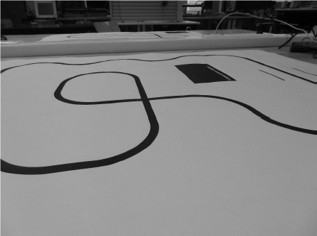

# LineFollower

lege repository die je als template kan gebruiken om een eigen repository te starten voor uw linefollower project

  
## specifications

microcontroller: esp-32 devkit v1

motors: GA12-N20 Tandwielmotor Dc 3V/6V/12V N20 Mini Micro Metalen Tandwielmotor Met Tandwiel Dc Motoren 15/30/50/60/100/200/300/500/1000Rpm

h-bridge: drv 8833

sensors:qtr-8

batteries:

wireless communication: 

distance sensor - motors:

weight:

speed: 0,55m/s

